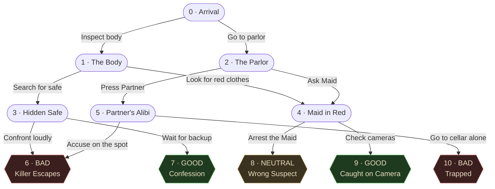

# OOP Structure — *Murder at Blackwood Manor*

## System Overview

- The app is a **Choose-Your-Own-Adventure** murder mystery built in Flutter.
- The story logic is split into **two classes** so the UI never touches raw data:
  `Scene` — a plain *data model* describing one page of the story.
  `StoryBrain` — the *engine* that holds all scenes and tracks where the player is.
- The UI (`StoryScreen`) only calls **public methods** on `StoryBrain`. It never reaches into the scene list directly.
- This separation means: **change the script → no UI changes needed. Change the UI → no story changes needed.**

```
┌────────────┐  asks for text/choices  ┌─────────────┐  reads from  ┌──────────────┐
│ StoryScreen│ ─────────────────────►  │ StoryBrain  │ ───────────► │ List<Scene>  │
│  (UI)      │  ◄───────────────────── │ (logic)     │              │ (data)       │
└────────────┘   storyText, choices    └─────────────┘              └──────────────┘
```

---

## 1. `Scene` Class — the Data Model

- One `Scene` = one page of the story.
- It is a **dumb container**: it only holds data, no logic.
- All fields are `final` so a scene can never change after it's created.

### Properties

| Property      | Type             | Purpose                                                       |
|---------------|------------------|---------------------------------------------------------------|
| `storyText`   | `String`         | The narration the player reads on this page.                  |
| `choices`     | `List<String>`   | The labels shown on the choice buttons.                       |
| `nextScenes`  | `List<int>`      | Parallel list of scene indices — choice *i* leads to scene *nextScenes[i]*. |
| `imagePath`   | `String`         | Path to the scene's image asset (R4).                         |
| `isEnding`    | `bool`           | `true` if this scene ends the story (R6).                     |
| `endingLabel` | `String?`        | Label shown on the end screen (e.g. *"Good Ending"*).         |

### Code Snippet

```dart
class Scene {
  final String storyText;
  final List<String> choices;
  final List<int> nextScenes;
  final String imagePath;
  final bool isEnding;
  final String? endingLabel;

  const Scene({
    required this.storyText,
    required this.choices,
    required this.nextScenes,
    required this.imagePath,
    this.isEnding = false,
    this.endingLabel,
  });
}
```

### How `choices` and `nextScenes` work together

- They are **parallel lists** — same length, same order.
- Pressing button at index `i` jumps to scene `nextScenes[i]`.

```dart
Scene(
  storyText: "You arrive at the manor...",
  choices:    ['Inspect the body', 'Go to the parlor'],
  nextScenes: [ 1,                   2                ],
  imagePath:  'assets/images/scenes/scene_00_arrival.png',
);
// Tap "Inspect the body" → go to scene 1.
// Tap "Go to the parlor" → go to scene 2.
```

---

## 2. `StoryBrain` Class — Logic & State

- Holds **every** `Scene` in a single private list.
- Tracks **where the player currently is** with a private index.
- Exposes a small set of **public methods** the UI is allowed to call.

### Encapsulation — why the underscore?

- In Dart, a leading underscore (`_`) makes a field **library-private**.
- The UI **cannot read or write** `_currentScene` or `_scenes` directly.
- It must go through public methods, so the brain stays in control of its own state.

```dart
class StoryBrain {
  int _currentScene = 0;
  final List<Scene> _scenes = const [ /* ...all 11 scenes... */ ];

  String       getStoryText() => _scenes[_currentScene].storyText;
  List<String> getChoices()   => _scenes[_currentScene].choices;
  bool         isGameOver()   => _scenes[_currentScene].isEnding;

  void nextScene(int choiceIndex) { /* ... */ }
}
```

### Public Methods

| Method                  | Returns         | What it does                                                              |
|-------------------------|-----------------|---------------------------------------------------------------------------|
| `getStoryText()`        | `String`        | Returns the narration for the current scene.                              |
| `getChoices()`          | `List<String>`  | Returns the choice button labels for the current scene.                   |
| `nextScene(int index)`  | `void`          | Advances the story based on which choice was tapped.                      |
| `isGameOver()`          | `bool`          | `true` if the current scene is an ending — the UI should jump to the end screen. |
| `getImagePath()`        | `String`        | Returns the asset path for the current scene's image.                     |
| `getEndingLabel()`      | `String`        | Returns the label of the current ending (e.g. *"Good Ending"*).           |
| `restart()`             | `void`          | Resets the player back to scene 0.                                        |

### `nextScene()` in detail

```dart
void nextScene(int choiceIndex) {
  final scene = _scenes[_currentScene];
  if (scene.isEnding) return;                                 
  if (choiceIndex < 0 || choiceIndex >= scene.nextScenes.length) return;
  _currentScene = scene.nextScenes[choiceIndex];              
}
```

- Reads the **current** scene.
- Looks up which scene that choice points to.
- Updates the private `_currentScene`.
- The UI then calls `setState()` and the screen rebuilds with the new text/choices/image.

---

## 3. Story Flow Diagram

The 11-scene graph for *Murder at Blackwood Manor*:



### Reading the diagram

- **Rectangles** = regular scenes with choices.
- **Hex shapes** = endings (no further choices).
- **Green** = good ending · **Yellow** = neutral · **Red** = bad.
- Two scenes (`6` and `4`) are **shared** between paths — they can be reached from more than one place.

---

## 4. How a Choice Travels Through the Code

A short tour of what happens when the player taps a button:

1. **UI** — `StoryScreen` calls `_brain.nextScene(index)`.
2. **Brain** — `StoryBrain` looks up `_scenes[_currentScene].nextScenes[index]` and updates `_currentScene`.
3. **UI** — `setState(() { ... })` schedules a rebuild.
4. **UI** — On rebuild it calls `getStoryText()`, `getChoices()`, `getImagePath()` again — fresh values come back because `_currentScene` changed.
5. **UI** — If `isGameOver()` is `true`, push the `EndingScreen` instead.

```dart
void _onChoice(int index) {
  setState(() {
    _brain.nextScene(index);   
  });
  if (_brain.isGameOver()) {
    Navigator.of(context).pushReplacement();
  }
}
```

---

## 5. Why This Design Matters

- **Single source of truth** — story state lives in one place (`StoryBrain`), not scattered across widgets.
- **Encapsulation** — the UI cannot accidentally corrupt the story by editing `_currentScene` directly.
- **Testability** — `StoryBrain` has no Flutter imports, so it can be unit-tested without rendering anything.
- **Replaceability** — swap the script in `_scenes` and the entire app retells a new story with zero UI edits.
